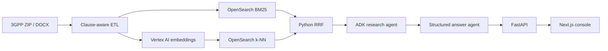

# Spec Copilot

Agentic retrieval over public telecom specifications. Spec Copilot ingests a pinned
3GPP TS 23.501 Release 17 document, preserves its clause structure, combines BM25
and vector search in OpenSearch, and returns Gemini answers with exact source
passages.

This project uses public 3GPP material only. It is not a Nokia system and does not
contain Nokia data.

## What is implemented

- Verified download of `23501-hf0.zip` and safe extraction of `23501-hf0.docx`
- Word-style-aware clause parsing with inline tables and annex support
- LlamaIndex clause-safe chunking with no cross-clause windows
- Vertex AI `gemini-embedding-001` embeddings with a local SQLite cache
- OpenSearch 2.19.5 BM25 and k-NN retrieval fused with Reciprocal Rank Fusion
- LangChain search tools orchestrated by a two-stage Google ADK workflow
- Pydantic structured answers with post-generation citation validation
- FastAPI query/health endpoints and a small accessible Next.js 15 console
- A ten-question retrieval evaluation set



## Verified corpus

The local parser was run against the pinned source on July 27, 2026:

| Input | Clauses parsed | Chunks at 800 tokens |
| --- | ---: | ---: |
| TS 23.501 V17.15.0 (`23501-hf0`) | 894 | 1,100 |

The archive SHA-256 is
`26a44ebac62fb954d8be7747eaade48c9bf5949867a078bf11c6a445fc0b7ace`.
All eleven clauses referenced by the golden set were found by the real parser.

Retrieval scores are intentionally not listed yet. Run the authenticated evaluation
below and publish the resulting `eval/reports/latest.json`; do not substitute expected
or resume-target values.

## Prerequisites

- Python 3.12 and [uv](https://docs.astral.sh/uv/)
- Node.js 20+ and pnpm 10
- Docker Desktop with at least 4 GB available
- A Google Cloud project with Vertex AI enabled
- Application Default Credentials

```bash
gcloud auth application-default login
gcloud config set project YOUR_PROJECT_ID
```

`gcloud` is not installed by this repository and no service-account key should be
stored here.

## Local setup

```bash
cp .env.example .env
```

Set `GOOGLE_CLOUD_PROJECT` in `.env`, then install and start the local dependencies:

```bash
uv sync
pnpm --dir web install
docker compose up -d opensearch
```

Download, parse, embed, and index the pinned document:

```bash
uv run spec-copilot ingest
```

The first run downloads the source and creates embeddings. Later runs reuse the
verified archive and the SQLite embedding cache.

Start the API and console in separate terminals:

```bash
uv run uvicorn spec_copilot.api:app --reload
```

```bash
pnpm --dir web dev
```

Open [http://localhost:3000](http://localhost:3000). Useful demo questions:

1. `What are service-based interfaces used for?`
2. `How is a serving AMF selected for requested network slices?`
3. `Summarize clause 4.2.6.`

## API

`POST /query`

```json
{
  "question": "What are service-based interfaces used for?"
}
```

The response follows this shape:

```json
{
  "answer": "Grounded answer text.",
  "citations": [
    {
      "chunk_id": "content hash",
      "spec_id": "TS 23.501",
      "release": "Rel-17",
      "clause_number": "4.2.6",
      "title": "Service-based interfaces",
      "quoted_span": "Verbatim text from the retrieved chunk."
    }
  ],
  "confidence": "high",
  "unanswered_aspects": []
}
```

`GET /health` reports Vertex configuration, OpenSearch availability, and the current
index document count. Ingestion is intentionally CLI-only; exposing an unauthenticated
write endpoint would be unsafe.

## Evaluation

After ingestion:

```bash
uv run spec-copilot eval
```

The command evaluates recall@5 and mean reciprocal rank over
`eval/golden_set.jsonl`, prints the report, and writes
`eval/reports/latest.json`. Generated reports are ignored until someone explicitly
reviews and publishes the measured values.

## Development checks

```bash
uv run ruff check .
uv run pytest
pnpm --dir web lint
pnpm --dir web build
```

The integration test expects the Compose service:

```bash
uv run pytest tests/test_opensearch_integration.py -q
```

## Source-data note

3GPP specifications are fetched at runtime from the
[official archive](https://www.3gpp.org/ftp/Specs/archive/23_series/23.501/).
The repository does not redistribute the source document. Review 3GPP's terms before
redistributing excerpts or derivative corpora.

## Deliberately deferred

Neo4j/text-to-Cypher, Release 16 comparisons, Vertex AI Search benchmarking,
reranking, persistent traces, SSE, GitLab CI, and Cloud Run deployment are separate
milestones. They are not claimed by this vertical slice.
